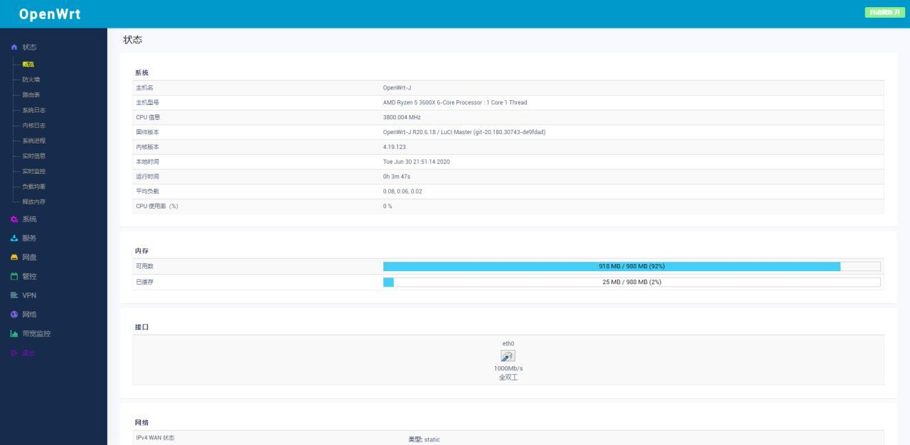
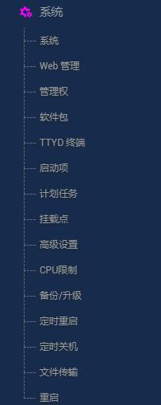
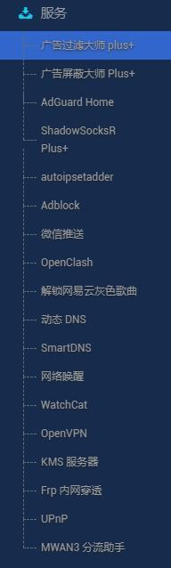
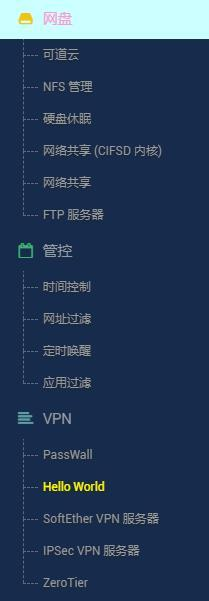

# P3TERX大佬opwnert固件云编译脚本

云编译地址：https://github.com/P3TERX/Actions-OpenWrt

固件源码地址：https://github.com/coolsnowwolf/openwrt

lean稳定源码版本，内核为4.19版，分为自用版和精简版两版

自动每3天更新一次，手动不定时更新

> ip：192.168.1.1 密码：password

追新版云编译地址：https://github.com/firker/openwrt-Exclusive

tg交流群：https://t.me/joinchat/OT5eDxpuH2Kek2bEekUp0w

频道订阅：https://t.me/zhinengchaoshenzhe

## 精简版固件截图：

## 自用版固件截图：
